# Nykaa Business Performance Dashboard  

This project is a comprehensive Excel-based advanced analytical 10 page **Reports+Dashboard** built on Nykaa’s sales and financial data.  
Original Raw dataset provide 2 tables i.e ActualSales (>470k rows and 30 Columns) and Budget/Target_Sales (>50k rows and 30 Columns).
Power Query is used to normalize, clean, transform the data and converting the data into **2 Fact** & **5 Dimensions** Tables i.e Actual_Sales, Budget/Target_Sales, Dim_Sku, Dim_Date, Dim_Location, Dim_Cluster & Dim_Channel and these data later on added to Power Pivot Data Model Data Modelling where I created relationship between the tables forming the **Galaxy Schema** (as there are 2 Fact Table) and also created multiple Medium to Advanced level **DAX** for achieving desired result for the report.
It uses **Pivot Tables, Charts, and Variance Analysis**  to provide deep insights into Net Revenue (NR), Gross Profit (GP), budget comparisons, performance across multiple business dimensions and how much they perform to meet the requirement of Targeted/Budget benchmark by Cluster, Locations, Channels, etc. 

---

## 📑 Table of Contents
1. [Pareto & SKU Level Turnover](#1-pareto--sku-level-turnover)  
2. [Channel, Cluster, etc. Analysis](#2-channel-cluster-etc-analysis)  
3. [Time Series](#3-time-series)  
4. [Marketing & Efficiency](#4-marketing--efficiency)  
5. [Expenditure](#5-expenditure)  
6. [YoY% Increase in Net Revenue](#6-yoy-increase-in-net-revenue)  
7. [Actual vs Budget](#7-actual-vs-budget)  
8. [Variance Analysis](#8-variance-analysis)  
9. [PVM Analysis](#9-pvm-analysis)  
10. [PVM Analysis 2](#10-pvm-analysis-2)  

---

## 1. Pareto & SKU Level Turnover  
- **Objective**: Identify high-performing products and understand their contribution to overall revenue and 2 charts on Products and Categories to find Sku level Turnover. 
- **Features**:  
  - Pareto chart highlighting the **80/20 rule** (20% products contributing to ~80% revenue).
  - Obervation: Out of 4205 Products 140 are the ones that contribute 80% of PAT.  
  - SKU-level turnover pivot for granular product performance tracking.
  - 2 **Pivot Tables and 2 chart** on top of that to see what Products and categories are contributing revenue in % of total Revenue and by how much of their Units in % is contributing by how much of total units.
  - Example from the image like **HairCare** category contributes total of staggering **13.7%** of Total NR eventhough in terms of Total Units sold it is just **2.7%** which showcase even with less units sold this product still generates a higher value of Revenue.
- **Visuals**: Bar/line charts.  

📷 Screenshot:  
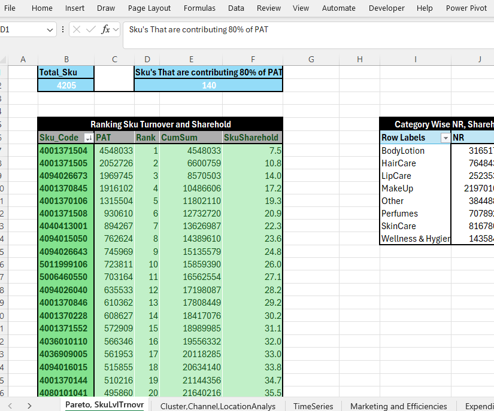 
    
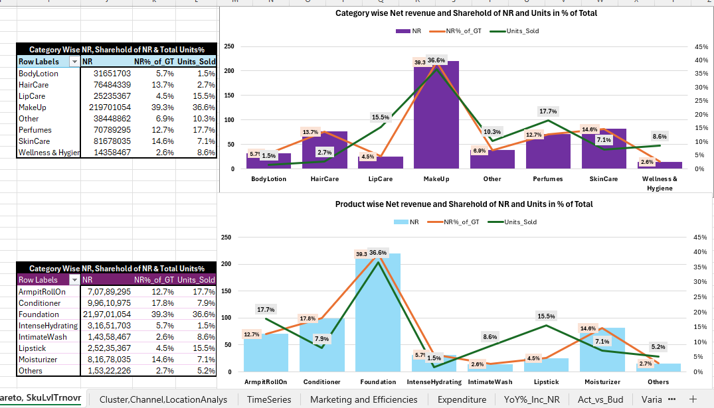 

---

## 2. Channel, Cluster, etc. Analysis  
- **Objective**: Analyze sales and revenue across different business dimensions for observing how much is earned via these segments.  
- **Features**:  
  - Total **6 Pivot tables** for **Channel, Cluster, Location, Product, and Category**.  
  - Metrics: Net Revenue, Year
- **Visuals**:None 

📷 Screenshot:  
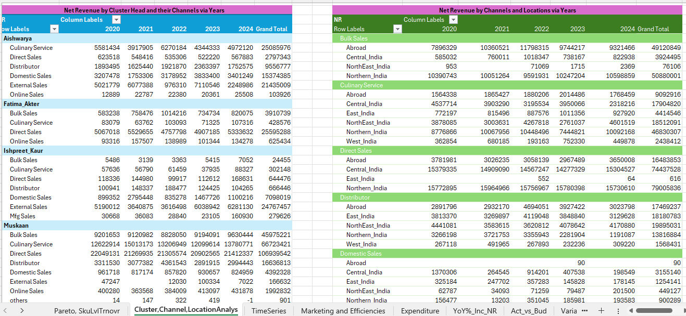  

---

## 3. Time Series  
- **Objective**: Track performance over time to identify seasonal or monthly trends across NetRevenue, COGS(Cost of Goods & Servie), Gross Profit & PAT(Profut After Tax).  
- **Features**:  
  - **1st Pivot tables & Area Chart** on **Year & Quarter** covering NR, COGS, Gross Profit & PAT.  
  - **2nd Pivot Table** cover NR growth over Same Quarter Last Year  **YoY% change** for growth tracking.
  - **3rd Pivot table** is about Monthly Net Revenue generation and one Pie Chart (but metrices(NR) here is in % of total)
- **Visuals**: Area Chart & Pie Chart 

📷 Screenshot:  
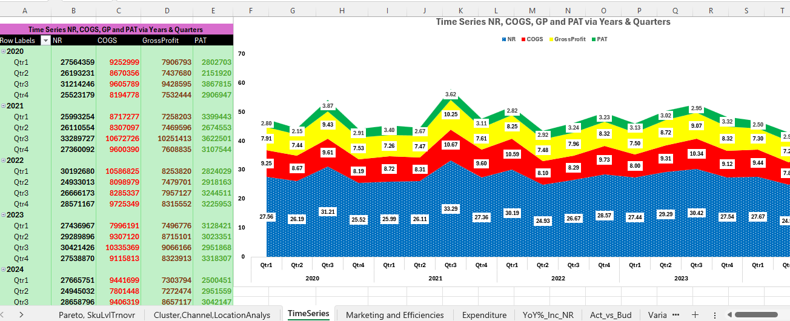  

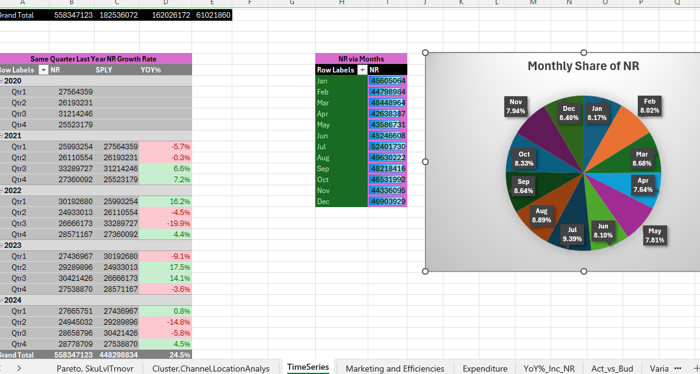  

---

## 4. Marketing & Efficiency  
- **Objective**: Evaluate marketing investments and efficiency in driving sales.  
- **Features**:  
  - **1st Pivot table and Line Chart** on top of that pivot showcase **Yearly** and monthly NR generated and Money spend on marketing (in % value of NR).
  - **2nd pivot Table and Line chart** on top of that showcase Yearly and Monthly **Volume(MT)** sold and sum of Money spend on marketing.
  - **3rd Pivot Table** showcase Location and Year wise efficiency of marketing means for every **₹1** of marketing how much revenue we generated.
  - KPIs: ROI%, efficiency ratios, and channel-wise marketing effectiveness.  
- **Visuals**: Line  charts showing correlation between spend and nr/volume.  

📷 Screenshot:  
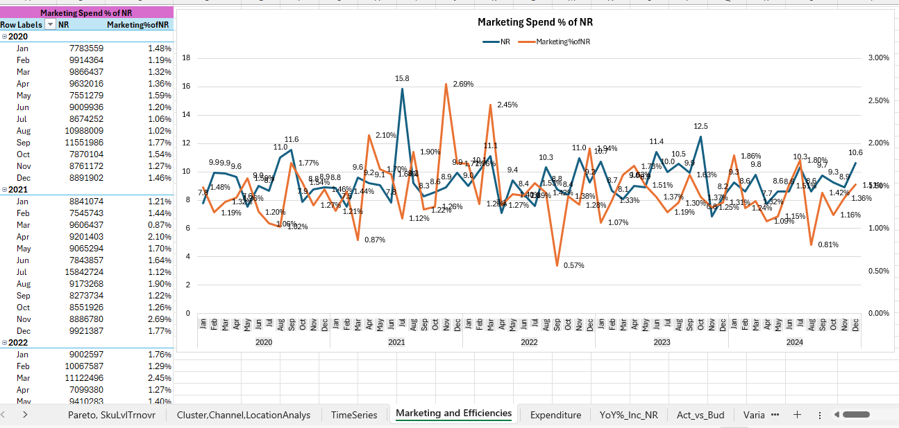  

_overTIMEseries.png)  

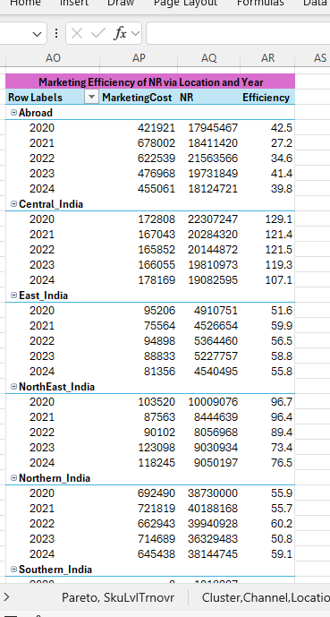  

---

## 5. Expenditure  
- **Objective**: Break down and analyze expenditures across categories.  
- **Features**:  
  - **1st Pivot table & Waterfall Chart** on expenditure on 6 fields i.e. RawMaterial, Trade&Disc, VariableCost, S&D_cost (sales & department), G&A cost and Marketing Cost. 
  - **2nd Pivot Table and Column&Line Chart** on Net Revenue and expenditure on Raw Material(in % value of NR) over years (as we see from the first/earlier chart that we spend most on **Raw Material** around 50% of total NR).
  - and finally **6 pivot Tables** on Year, Location, ClusterHead, Channels, Products and Categories on capturing  NR,Ebidta,	Ebidta%	of NR, COGS,	COGS% of NR, Tax,Tax% of NR, Trade&Disc,	T&D% of NR.

  
- **Visuals**: Column&Line charts, Waterfall Chart  

📷 Screenshot:  
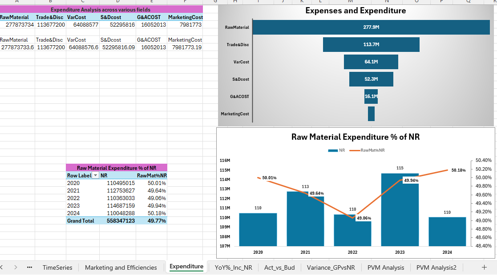  
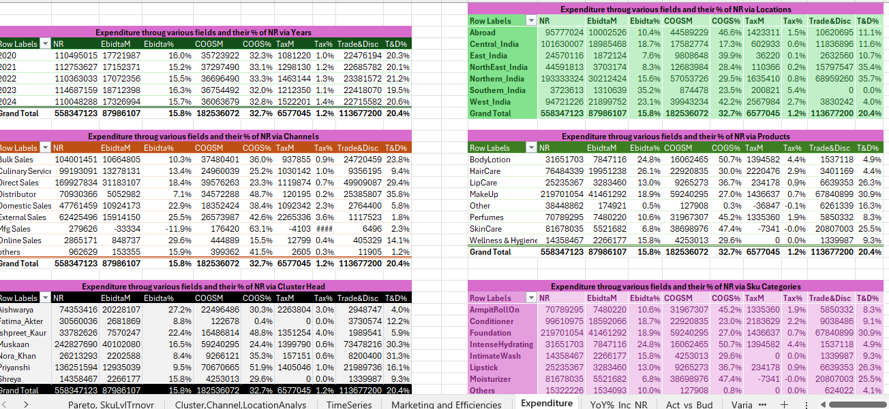  

---

## 6. YoY% Increase in Net Revenue  
- **Objective**: Measure year-on-year revenue performance.  
- **Features**:  
  - **1stPivot table & Column&Line Chart** comparing **Actual NR vs Last Year NR** and YoY% increase/decrease of NR.
  - **5 Pivot Tables** on Channels,ClusterHeads, Locations, Products & Categories.  
  -   
- **Visuals**: Column&Line Chart
📷 Screenshot:  
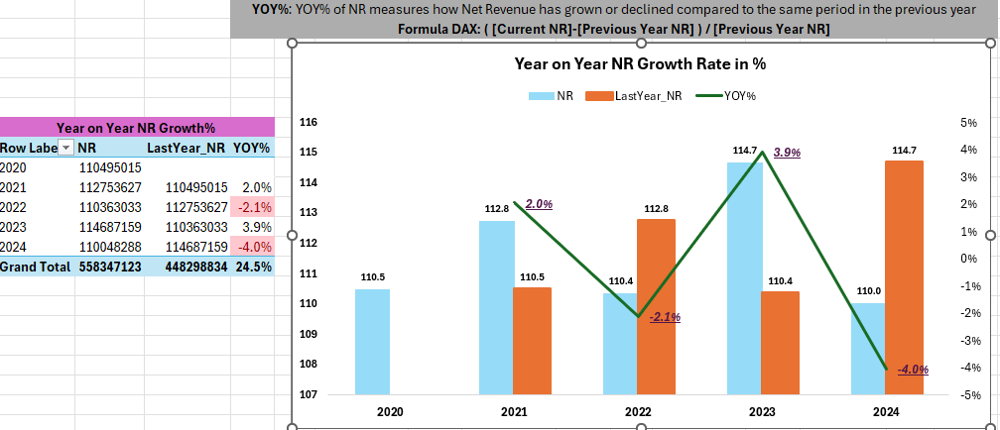
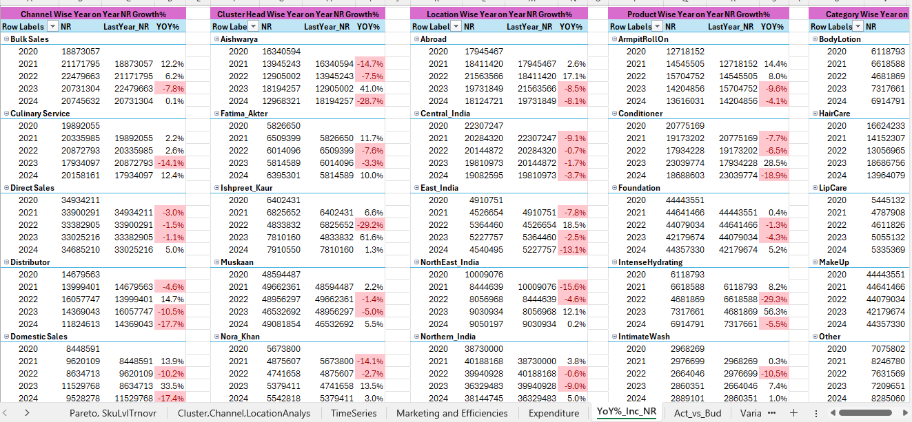  

---

## 7. Actual vs Budget  
- **Objective**: Assess how actual performance compares against budgeted targets.  
- **Features**:  
  - Pivot tables for **Cluster, Channel, Location, Product, and Category** and **5 column&Line Chart** on Metrics , Actual NR, Budget/target NR and NR missed/achieve in %.  
  - KPIs: Actual NR, Budget NR, % Achieved/Missed.  
- **Visuals**:5 Column + line charts showing achievement % trends.
- 
📷 Screenshot:
  
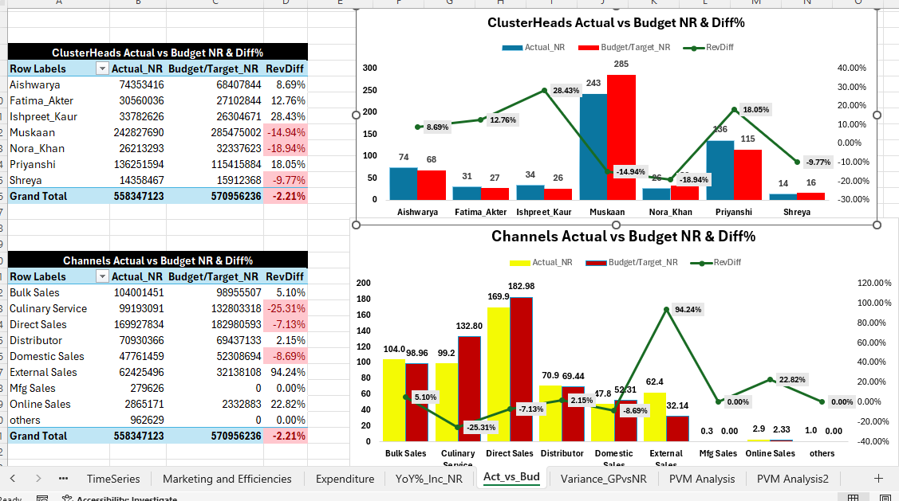  

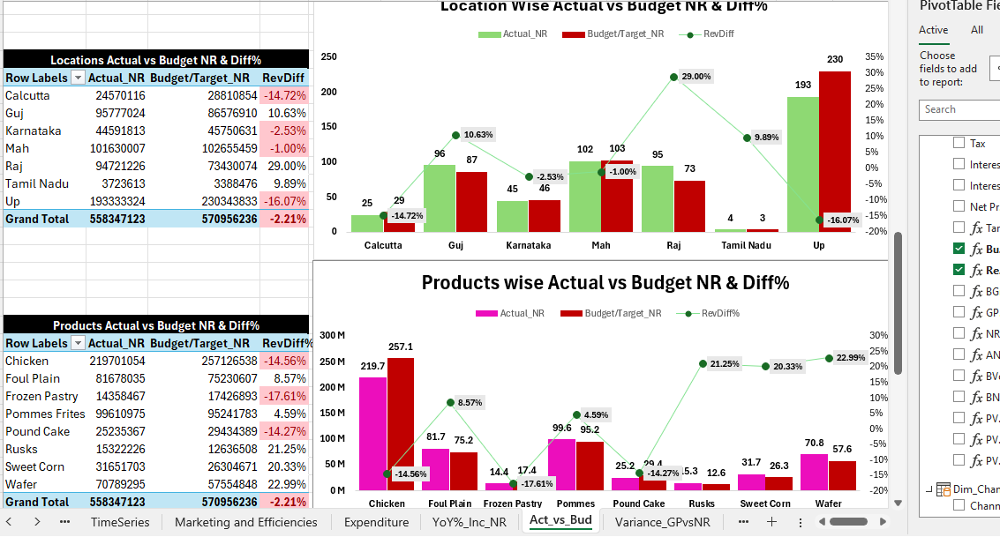  

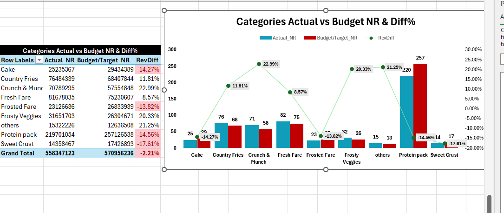  

---

## 8. Variance Analysis  
- **What is Variance Analysis?**
- **Answer** - Variance Analysis:Variance analysis on Gross Profit (GP) and Net Revenue (NR) is done to evaluate how product categories perform by comparing Actuals against Budget/Targeted,helping to identify revenue shortfalls, cost impacts, and areas of outperformance.
- **Formula DAX:**
- **GP_Variance% (Gross Profit Variance %)**: *([Actual_GrossProfit] - [Budget_GrossProfit]) / [Budget_GrossProfit] * 100*
- **NR_Variance% (Net_Revenue Variance %)**: **([Actual_Net_Revenue] - [Budget_Net_Revenue]) / [Budget_Net_Revenue] * 100*
- 
- **Objective**: Deep dive into performance gaps.
- 
- **Features**:  
  - **1st Pivot Table and Scatter Chart** or *variance Analysis on Categories* for GP_Variance% and NR_Variance% to showcase how much and by what % they are able to achieve or miss the Budget/Target mark.
  - **2nd Pivot Table and Scatter Chart** or *variance Analysis on Products* for GP_Variance% and NR_Variance% to showcase how much and by what % they are able to achieve or miss the Budget/Target mark.
  - **4 Pivot Tables** on Variance Analysis on Year, Location, ClusterHead and Channels to observe their performace across Quarters or Years.
  - 
- **Visuals**:  
 - Scatterplot
 - 
📷 Screenshot:  
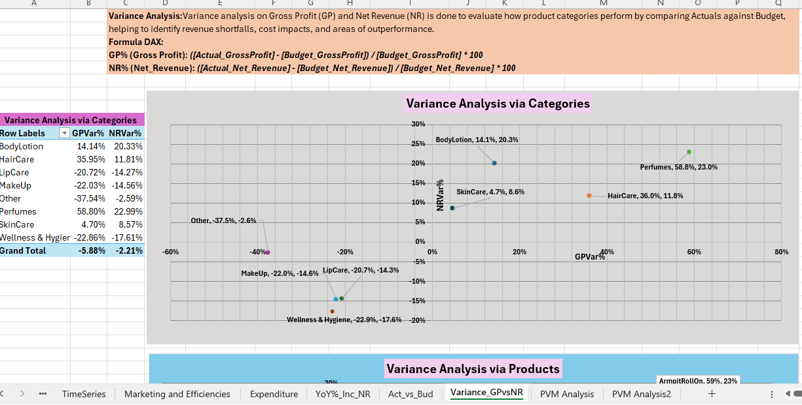
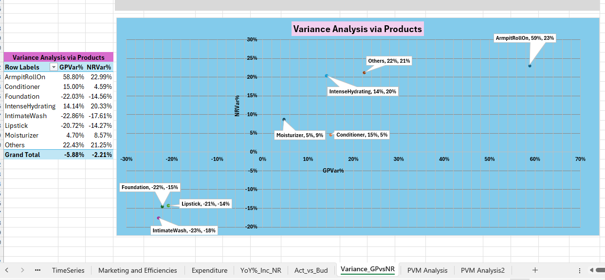  
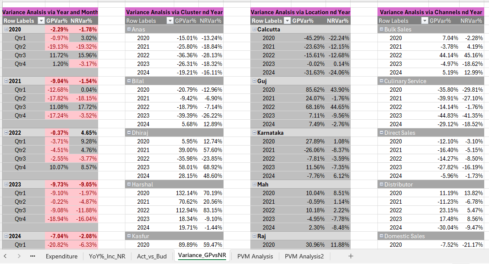  
 

---

## 9. PVM Analysis  
- **Objective**: Perform **Price-Volume-Mix** analysis on Actual vs Budget NR.  
- **Features**:  
  - **Pivot table and Waterfall Chart** showcasing impact of **Price, Volume, and Mix**.  
- **Visuals**: Waterfall chart to show drivers of revenue variance.  

📷 Screenshot:  
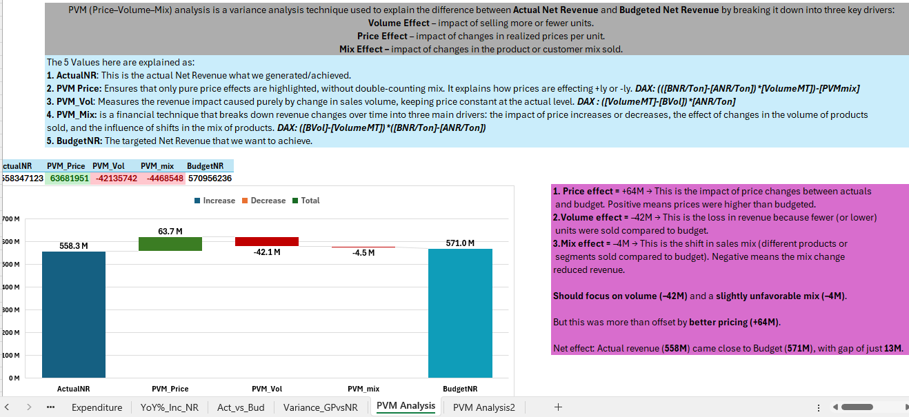  

---

## 10. PVM Analysis 2  
- **Objective**: Extend PVM analysis with multi-dimensional cuts.  
- **Features**:  
  - **1st Pivot Table** on Year & Month capturing Actual NR, PVM_Price, PVM_Volume, PVM_Mix & Budget NR.
  - **2nd Pivot Table** on ClusterHeads & Years capturing Actual NR, PVM_Price, PVM_Volume, PVM_Mix & Budget NR.
  - **3rd Pivot Table** on Locations & Channels capturing Actual NR, PVM_Price, PVM_Volume, PVM_Mix & Budget NR.
  - 
📷 Screenshot:  
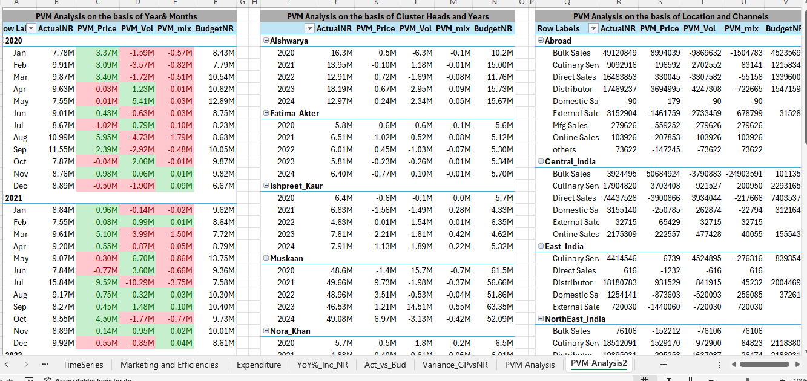  

---

## 📂 Project Structure

### 🛠️ Tech Stack
- **Excel Power Query** → Data cleaning & table transformations  
- **Excel Power Pivot** → Data modeling & relationships
- **DAX** -- Advanced level DAx for creating measures.
- **Pivot Tables & Charts** → Visual reporting (Pareto, Scatter, Waterfall, Column-Line, Area)  

---

### 📌 How to Use
1. Clone this repo.  
2. Open the Excel file to explore dashboards.  
3. Review PNG screenshots in `/images` folder for preview.  
Note: Here Excel workbook which i provided in GitHub repository is just a snapshot of original Workbook/Project if you want the original raw Dataset (190 Mb) or entire Project (125 mb) with Power Query Connections and Power Pivot Data modelling contact me to my Email Address mention below
---

### 📷 Data Model & Queries
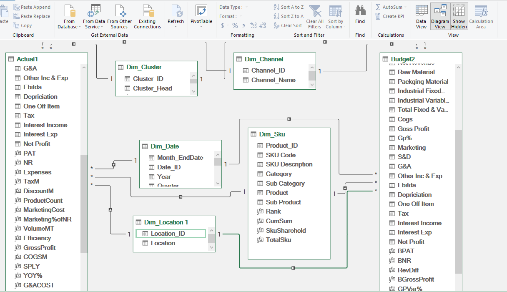  
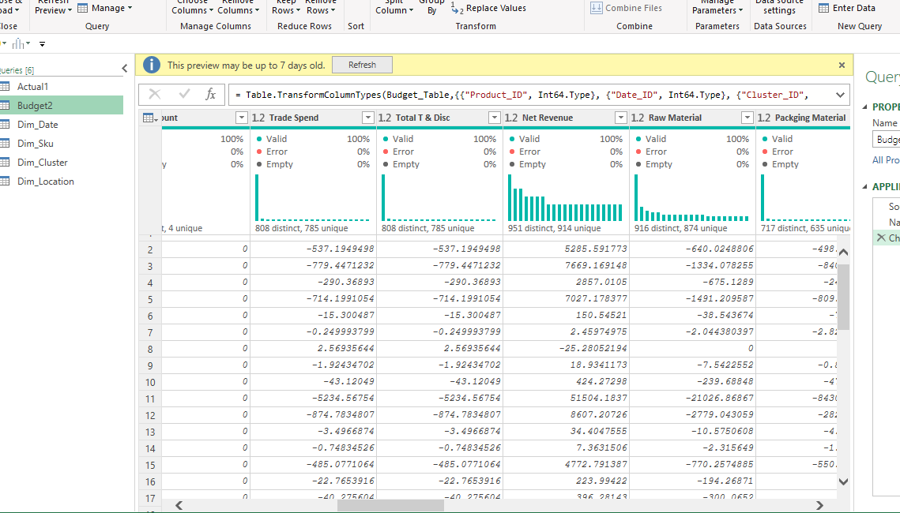  
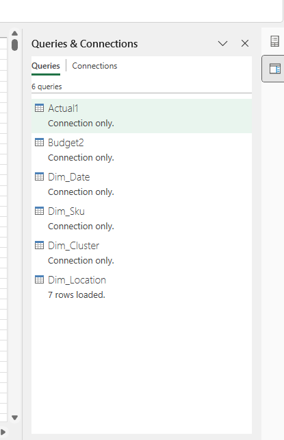  
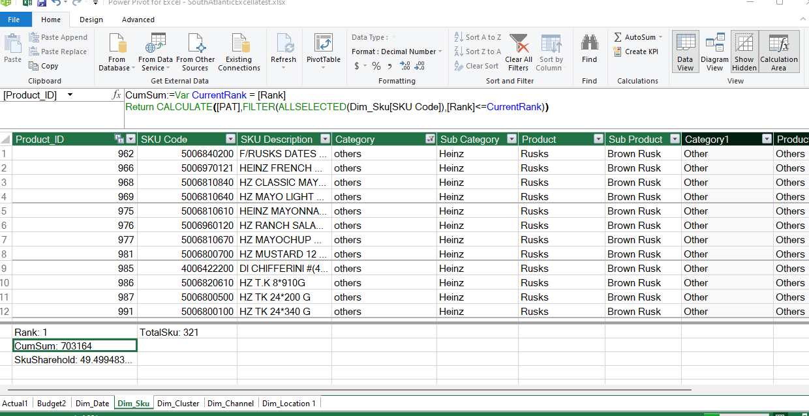  
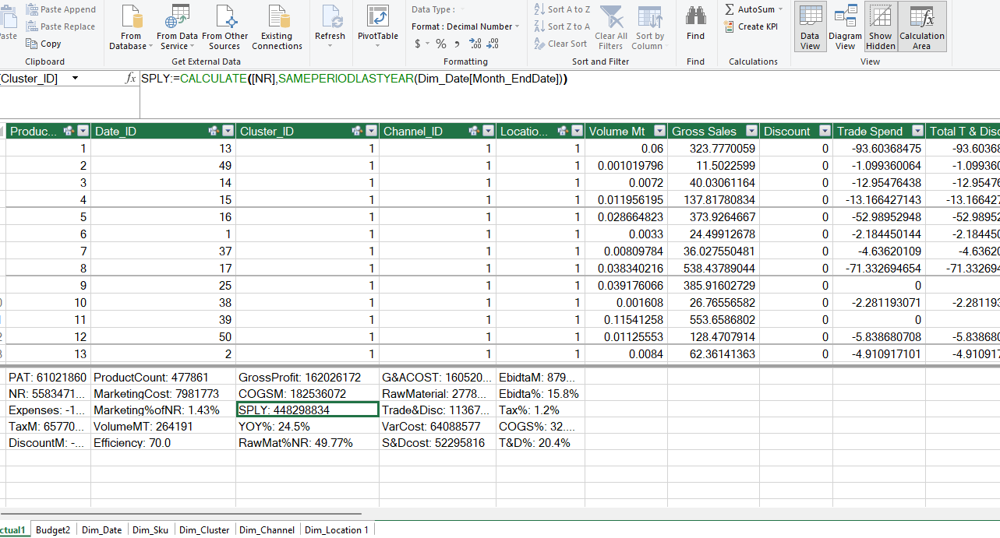  

---

### ✅ Key Highlights
- End-to-end BI reporting solution in **Excel**, handling ~520K rows.
- Power Query Optimization to made connection and adding 7 tables into Data Model.
- Power Pivot Data Modelling showcasing Galaxy Schema (2 Fact and 5 Dimension table)
- Covers **Revenue, Profitability, Marketing Spend, Variance, and PVM Analysis**.  
- Designed as a **single-source reporting tool** for business decision-making.  

---

👤 **Author**: [Abhit Bhatt]  
📅 **Year**: 2025 
**Email_ID** : its_abhitbhatt@insightforgecom.com or abhitbhatt07@gmail.com
